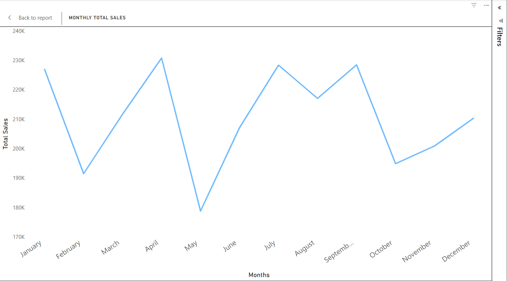
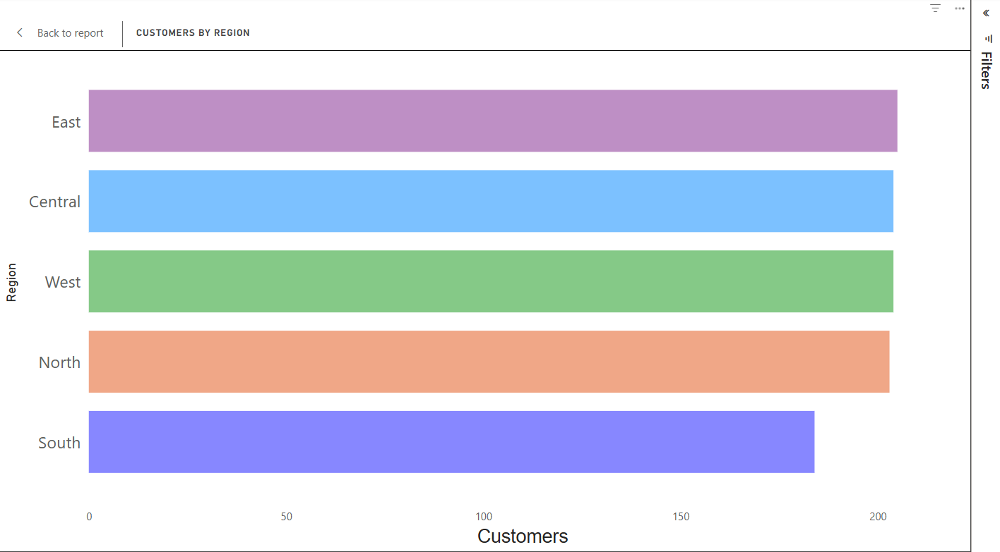

# Sales Analysis Dashboard (Power BI)
This project analyzes customer orders using Power BI. It includes:
- Total Sales
- Total Orders
- Sales by Product Category
- Monthly Sales Trends
- Customer Segmentation by Region
- Average Order Value
- Month-over-Month Sales Growth

Tools used:
- Power BI
- DAX Measures
- Power Query (M)

The main file is:
- `Sales_Analysis_Dashboard.pbix`

## Dashboard Preview

### Full dashboard

### Monthly sales trend

### Sales by category

### Customers by region

More documentation will be added soon.
